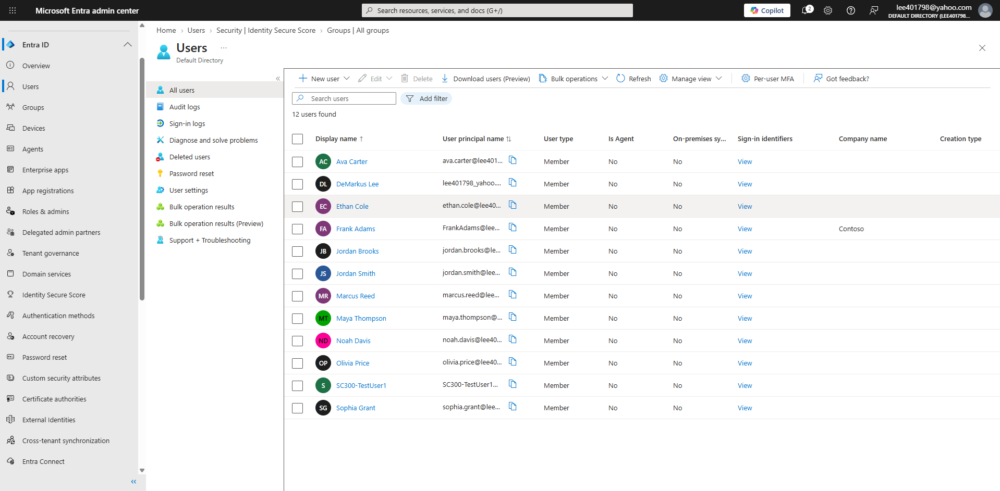
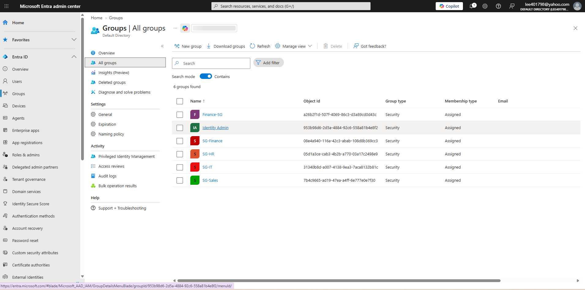
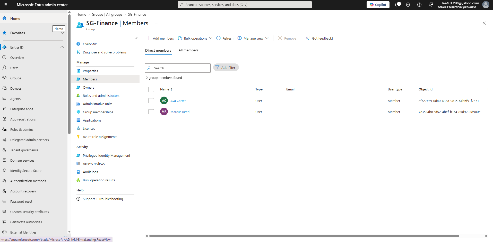
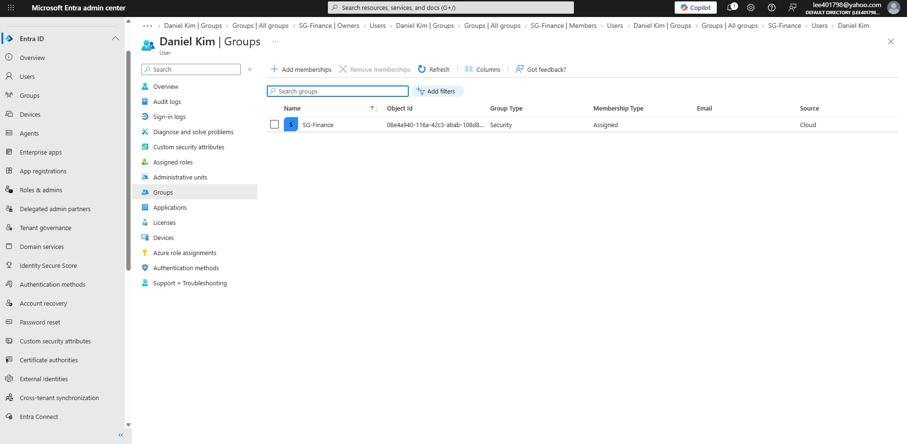
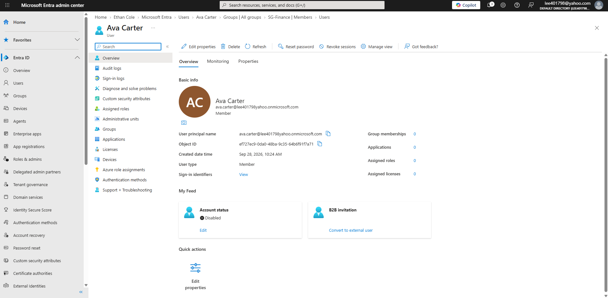

# Microsoft Entra ID – Joiner, Mover, Leaver IAM Lab

## Overview

This project demonstrates identity lifecycle management in Microsoft Entra ID using a simulated financial services organization.

The lab focuses on the Joiner-Mover-Leaver (JML) lifecycle and demonstrates how identity administrators provision users, manage security group access, modify permissions when employees change roles, and deprovision access when employees leave an organization.

The objective was to apply least-privilege principles and reduce unnecessary access throughout the identity lifecycle.

---

## Technologies Used

- Microsoft Entra ID
- Microsoft Entra Admin Center
- Azure
- Microsoft Entra Security Groups
- Microsoft Entra Administrative Roles
- Role-Based Access Control concepts
- Identity Lifecycle Management

---

## Business Scenario

Contoso Financial Services needs a structured identity lifecycle process for employees across several departments:

- Finance
- Human Resources
- Sales
- Information Technology
- Security

The organization requires:

1. New employees to receive appropriate departmental access.
2. Employees changing departments to have outdated access removed.
3. Terminated employees to immediately lose access to organizational resources.
4. Administrative privileges to follow the principle of least privilege.

## Identity Lifecycle Workflow

The following diagram summarizes the Joiner-Mover-Leaver workflow implemented in this lab.

# Lab Environment

Test users were created across multiple departments.

| User | Department | Job Title |
|---|---|---|
| Ava Carter | Finance | Financial Analyst |
| Marcus Reed | Finance | Finance Manager |
| Jordan Brooks | HR | HR Specialist |
| Olivia Price | HR | HR Manager |
| Ethan Cole | Sales | Sales Representative |
| Maya Thompson | Sales | Account Manager |
| Noah Davis | IT | IT Support Specialist |
| Sophia Grant | Security | Security Analyst |

Security groups were created using the following naming convention:

- SG-Finance
- SG-HR
- SG-Sales
- SG-IT
- SG-Security

---

## User and Group Provisioning

Users were created in Microsoft Entra ID with department and job title attributes.

Departmental security groups were then created to manage access based on business function.

Example Finance group membership:

---

# Joiner Scenario

## Business Requirement

Daniel Kim joined Contoso Financial Services as a Junior Financial Analyst.

### Actions Performed

- Created a new Microsoft Entra user account
- Assigned the Finance department attribute
- Assigned the appropriate job title
- Added Daniel to the SG-Finance security group
- Verified group membership

### Security Principle

Access was granted based on Daniel's business role rather than providing broad access to organizational resources.

---

# Mover Scenario

## Business Requirement

Ethan Cole transferred from the Sales department to Finance.

### Actions Performed

- Updated Ethan's department from Sales to Finance
- Updated his job title
- Removed Ethan from SG-Sales
- Added Ethan to SG-Finance
- Verified that outdated Sales access was removed

### Security Principle

Removing access from the previous department helps prevent **access creep**, where users accumulate permissions that are no longer required for their current job responsibilities.

---

# Leaver Scenario

## Business Requirement

Ava Carter left Contoso Financial Services.

### Actions Performed

- Blocked user sign-in
- Revoked active sessions
- Removed the user from SG-Finance
- Reviewed remaining group memberships
- Retained the disabled identity rather than immediately deleting the account

### Security Principle

Disabling access before account deletion helps immediately prevent unauthorized access while preserving the identity for auditing, retention, investigation, or downstream administrative processes.

---

# IAM Concepts Demonstrated

This lab demonstrates:

- Identity provisioning
- Identity deprovisioning
- Joiner-Mover-Leaver lifecycle management
- Security group administration
- Role-based access concepts
- Least privilege
- Access removal
- Session revocation
- Access creep prevention
- User attribute management
- Identity governance fundamentals

---

# Challenges and Troubleshooting

During previous Microsoft Entra lab work, some advanced identity features such as dynamic group membership were restricted by tenant licensing.

This reinforced the importance of understanding the relationship between Microsoft Entra licensing and advanced IAM functionality.

For this project, assigned security groups were used to demonstrate identity lifecycle management without depending on premium licensing.

---

# Lessons Learned

This project reinforced several important IAM concepts:

1. User access should be based on current business responsibilities.
2. Access from previous roles should be removed when employees transfer departments.
3. Terminated users should have access disabled promptly.
4. Security groups simplify access administration compared with managing permissions individually.
5. Least privilege reduces unnecessary administrative and user access.
6. Identity lifecycle management is an ongoing process rather than a one-time account creation task.

---

## PowerShell Automation

A Microsoft Graph PowerShell script is included to demonstrate automation of the Joiner-Mover-Leaver lifecycle.

The script performs:

- New user creation
- Department and job title updates
- Security group membership changes
- User account disabling
- Sign-in session revocation

See the script here:

[`scripts/user-lifecycle.ps1`](scripts/user-lifecycle.ps1)

# Next Steps

Future improvements to this project will include:

- Microsoft Graph PowerShell automation
- Bulk user provisioning
- Automated user deprovisioning
- Dynamic group membership
- Administrative Units
- Microsoft Entra Conditional Access
- Privileged Identity Management
- Access Reviews
