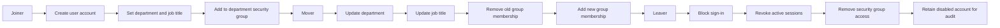

# Identity Lifecycle Diagram

```mermaid
flowchart LR
    A[Joiner] --> A1[Create user account]
    A1 --> A2[Set department and job title]
    A2 --> A3[Add to department security group]

    A3 --> B[Mover]
    B --> B1[Update department]
    B1 --> B2[Update job title]
    B2 --> B3[Remove old group membership]
    B3 --> B4[Add new group membership]

    B4 --> C[Leaver]
    C --> C1[Block sign-in]
    C1 --> C2[Revoke active sessions]
    C2 --> C3[Remove security group access]
    C3 --> C4[Retain disabled account for audit]
```
